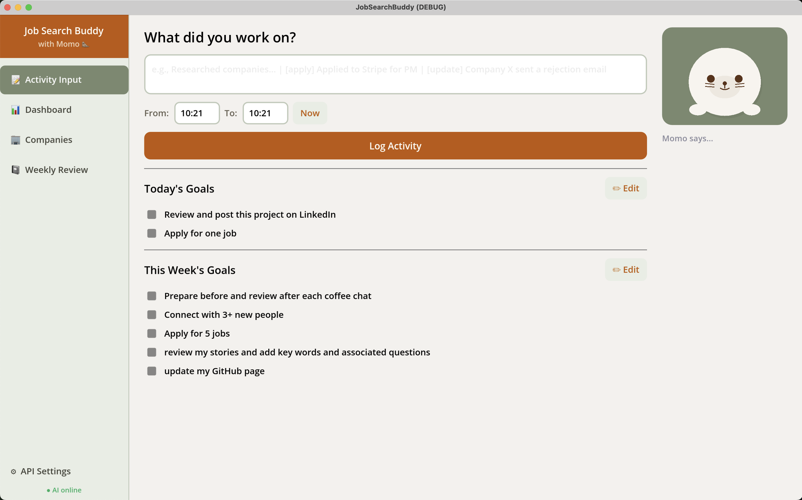

# Job Search Buddy

A desktop app for tracking your job search — with an AI buddy by your side.

Job searching is exhausting and lonely. This app gives you one place to log what you've done, see what's working, and hear an encouraging word when you need it. The buddy (Momo the seal, by default) responds to your progress using the Claude API.


<!-- Replace with your own screenshot -->

---

## Features

### Activity Logging
Type what you did and the app categorizes it automatically into one of five types: **Review, Research, Interview, Application,** or **Networking**. Log a time range and it tracks your hours too.

**Three input modes via prefix:**

| Prefix | What it does |
|---|---|
| *(none)* | Logs activity to Dashboard only |
| `[apply] …` | Logs an Application AND adds the company to your tracker |
| `[update] …` | Updates a company's progress in the tracker |

### Dashboard
- Pie chart showing time spent per activity category for a chosen date range (Today / This Week / This Month / All Time)
- Stats: Applications Sent, Interviews, Companies Tracked, Hours Spent

### Company Tracker
A table of every company you've applied to, automatically updated via `[apply]` and `[update]` tags. Progress states: **Applied / Stale / In-interview / Gone / Offer / Offer declined**

### Weekly Review
Log your feelings, wins, and areas for improvement at the end of each week. The AI summarizes long entries and keeps one record per week.

### Daily Flow
- Greeted by name each morning with a prompt for your top 1–2 goals
- Check off goals as you complete them — confetti fires when everything is done
- Type `review` to end the day and get an encouraging message from your buddy

---

## Tech Stack

| | |
|---|---|
| Engine | [Godot 4.6](https://godotengine.org/) |
| Language | GDScript |
| AI | [Claude API](https://www.anthropic.com/) — `claude-haiku-4-5` |
| Storage | Local JSON files via Godot's `user://` path |

All data is stored on your machine. Nothing is sent anywhere except the text you type, which goes to the Claude API to generate your buddy's responses.

---

## Setup

**Prerequisites:** [Godot 4.6](https://godotengine.org/download/)

1. Clone the repo
   ```bash
   git clone https://github.com/maiyama/job-search-buddy.git
   ```

2. Open Godot, click **Import**, and select `project.godot`

3. Press **F5** (or the Play button) to run

**Optional — enable AI responses:**

Without an API key the app runs with built-in fallback responses. To enable live AI:

1. Get an API key from [console.anthropic.com](https://console.anthropic.com/)
2. Open the app → click **Settings** (gear icon) → paste your key

Your key is saved locally and never committed to the repo.

---

## Customizing Your Buddy

The buddy character has three layers you can change independently:

**1. Name & personality** — edit `reference/BUDDY.md`

```markdown
## Name
Momo

## Personality
Encouraging, warm, supportive
```

The name you set here automatically updates all UI labels across the app. The personality description is injected into every AI prompt.

**2. UI name labels** — the name in `BUDDY.md` is the single source of truth. No other files need to be changed.

**3. Illustration** — edit `scripts/components/buddy_display.gd`. The character is drawn in code using Godot's `_draw()` API. Modify the shapes and colors to match your buddy, or swap it for an image by loading a texture with `draw_texture_rect()`.

---

## What I Learned

This was my first time building a desktop app in Godot, and my first time integrating an LLM into a personal productivity tool. A few things that stood out:

- **Godot as an app framework** — Godot's scene/node system and GDScript work surprisingly well for UI-heavy apps, not just games. Building the entire UI programmatically (no `.tscn` files except the root) kept everything in one place and easy to reason about.
- **Designing AI interactions that aren't annoying** — I had to think carefully about when the buddy *shouldn't* respond. Routine log entries get a plain confirmation; the AI is reserved for real moments (interviews, offers, end of day) so it doesn't feel hollow.
- **Keeping user data private by design** — Godot's `user://` path stores all personal data completely outside the project directory, so there's no risk of accidentally committing job search history to a public repo.

---

## Data & Privacy

All your data (activities, companies, weekly reviews) is stored locally at:

```
~/Library/Application Support/Godot/app_userdata/JobSearchBuddy/   # macOS
%APPDATA%\Godot\app_userdata\JobSearchBuddy\                        # Windows
```

The only external call is to the Anthropic API when your buddy responds. If you prefer full offline use, leave the API key blank — the app works without it.
